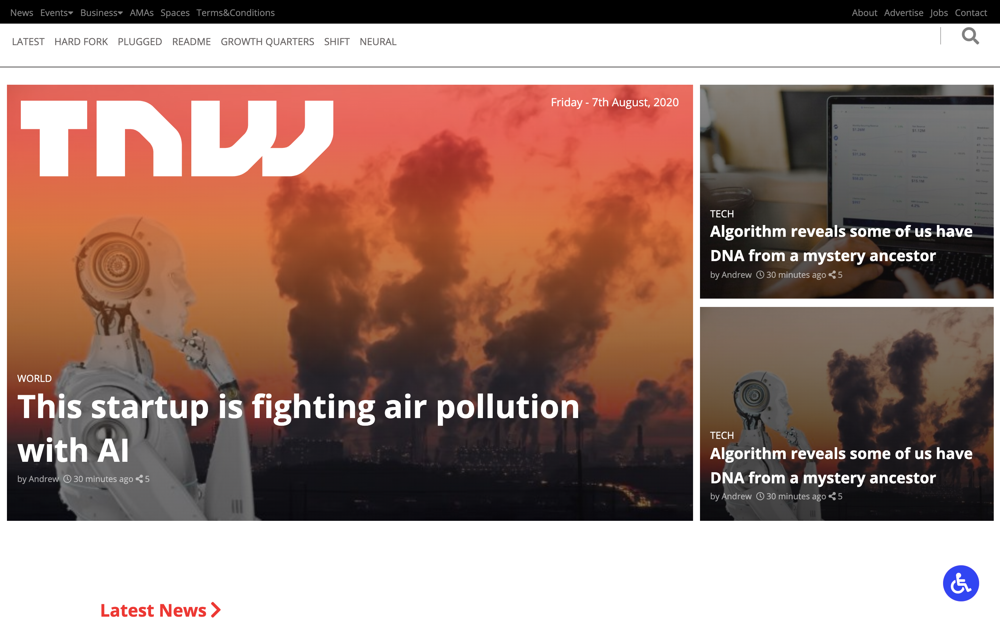

# the-next-web-clone

> This project consists of replicating the The Next Web website putting emphasis on how it behaves differently depending on the size of the screen where the website is rendered.

## Built With

- HTML,
- CSS

## Live Demo

[Live Demo Link](https://raw.githack.com/jrai0792/the-next-web-clone/feature-branch/index.html)

## Authors

👤 **Author1**

- Github: [@jrai0792](https://github.com/jrai0792)

👤 **Author2**

- Github: [@Adewunmi97](https://github.com/Adewunmi97)

## 🤝 Contributing

Contributions, issues and feature requests are welcome!

Feel free to check the [issues page](issues/).

## Show your support

Give a ⭐️ if you like this project!

## 📝 License

This project is [MIT](lic.url) licensed.
